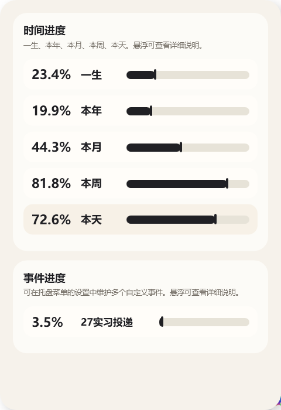

# LifeCountdown

受[起名zd难@xhs](https://xhslink.com/m/6NAXv5LGhNR)的启发，Vibe Coding了这个项目。

一个原生 `WPF/.NET 8` 的 Windows 小组件，用来显示：

- 本天进度
- 本周进度
- 本月进度
- 本年进度
- 一生进度
- 自定义倒计时

## 功能

主界面

托盘

任务栏

- 托盘常驻，双击托盘图标展开 / 隐藏
- 主界面可展开 / 收起系统隐藏托盘图标面板
- 托盘图标可显示所选目标的迷你进度条（支持一生 / 本年 / 本月 / 本周 / 本天 / 自定义目标）
- 可选在任务栏最右侧、托盘图标左侧显示一个小窗口：展示“名称 + 百分比”以及迷你进度条
- 实时刷新本天 / 本周 / 本月 / 本年 / 一生进度
- 可设置出生日期、预期寿命、一周起始日
- 可配置一个带标题、开始日期和目标日期的自定义倒计时
- 可切换悬浮窗固定在右上角或右下角
- 可一键打开 Windows 的系统托盘设置页，管理其他应用的托盘图标显示策略
